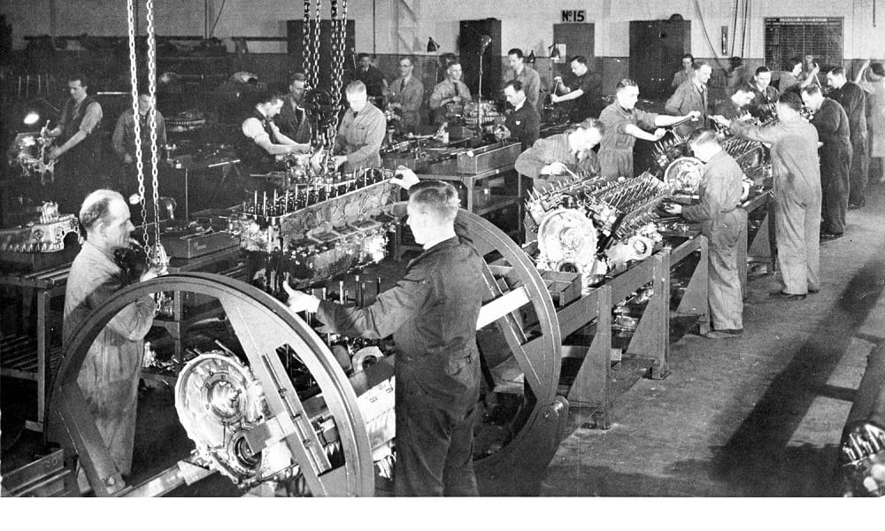
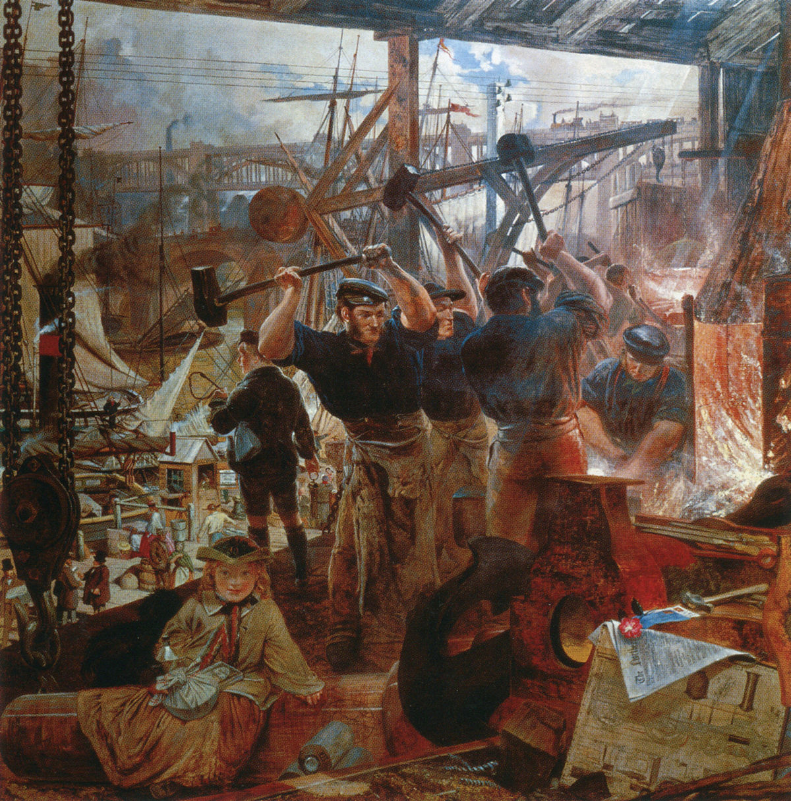
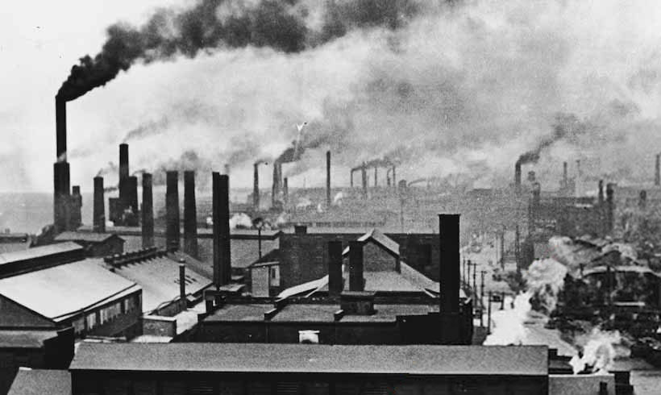
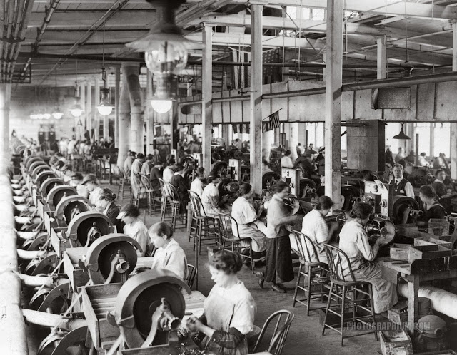
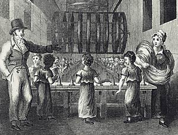
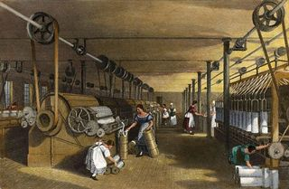

# Consequências da Revolução Industrial

# 1ª Apresentação | 2ºR - AINT - 2021/22
Camilla Carmo, nº10

# Introdução

Este trabalho foi realizado no âmbito da disciplina de Aint\. Neste trabalho irei explicar o que foi a Revolução Industrial e as consequências desta\.

# Revolução Industrial

A Revolução Industrial surgiu depois do desenvolvimento da máquina a vapor\.

__Porque aconteceu em Inglaterra?__

A Inglaterra foi a pioneira do desenvolvimento industrial por ser a nação que possuía as condições mínimas necessárias para desencadear esse processo\. Mas   também     a burguesia estabeleceu\-se no poder\, e isso garantiu o desenvolvimento da economia inglesa\, pois tomavam medidas que a fortalecem e atendiam seus interesses economicamente\.

# O trabalhador depois da Revolução Industrial

Não era mais necessário habilidades artesanais

Diminuição dos salários

Carga de trabalho excessiva

Trabalhos em fábricas era bastante perigosos\, que podiam causar perda de membros ou das próprias vidas

Mulheres e crianças também trabalhavam e seus salários eram\, pelo menos\, 50% menores do que os dos homens adultos

# Influências da revolução industrial no meio escolar

Reconhecimento que a educação era um direito fundamental para todos os cidadãos

Novos métodos de ensino dedicados a introduzir o ensino técnico e profissional desde uma tenra idade

Garantir mão de obra qualificada

Modelos teóricos de educação\, que tinha as mesmas características observadas na produção industrial:   tarefas repetitivas e mecânicas

# Conclusão

Com este trabalho podemos verificar que com a revolução Industrial criaram vários tipos de consequências\, sejam estas positivas como negativas\.

# Webgrafia

 _[https://abmes\.org\.br/blog/detalhe/15720/as\-revolucoes\-industriais\-e\-seu\-impacto\-na\-educacao](https://abmes.org.br/blog/detalhe/15720/as-revolucoes-industriais-e-seu-impacto-na-educacao)_ 

 _[https://mundoeducacao\.uol\.com\.br/geografia/trabalho\-infantil\-no\-mundo\.htm](https://mundoeducacao.uol.com.br/geografia/trabalho-infantil-no-mundo.htm)_ 

 _[https://mundoeducacao\.uol\.com\.br/geografia/o\-trabalho\-infantil\.htm](https://mundoeducacao.uol.com.br/geografia/o-trabalho-infantil.htm)_ 

 _[https://www\.gazetadopovo\.com\.br/educacao/como\-no\-seculo\-19\-nossas\-salas\-de\-aula\-pararam\-no\-tempo\-arjn56m7xzsmdid2inpnhu8cv/](https://www.gazetadopovo.com.br/educacao/como-no-seculo-19-nossas-salas-de-aula-pararam-no-tempo-arjn56m7xzsmdid2inpnhu8cv/)_ 

 _[https://mundoeducacao\.uol\.com\.br/historiageral/revolucao\-industrial\-2\.htm](https://mundoeducacao.uol.com.br/historiageral/revolucao-industrial-2.htm)_ 

 _[https://mundoeducacao\.uol\.com\.br/historiageral/fabricas\-tempo\-relogio\.htm](https://mundoeducacao.uol.com.br/historiageral/fabricas-tempo-relogio.htm)_ 

